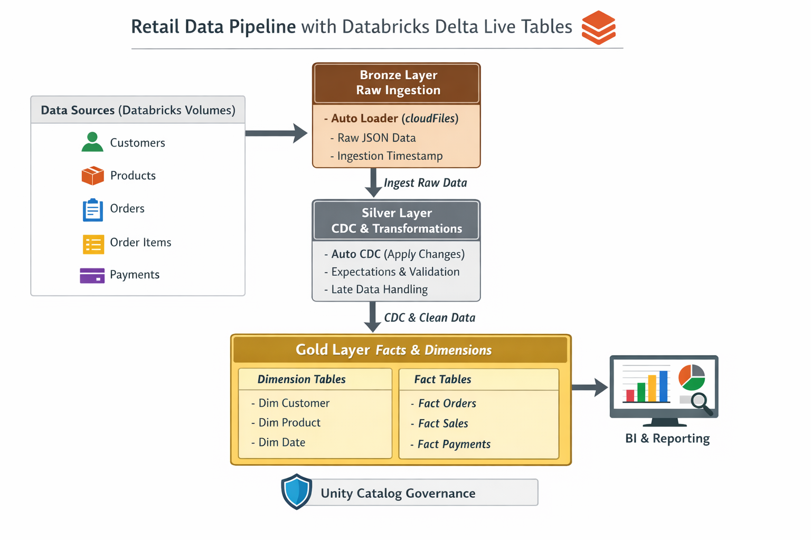

# 🚀 End-to-End Databricks Data Engineering Project (Delta Live Tables)

## 📌 Project Overview
This project demonstrates a **production-grade data engineering pipeline** built entirely using **Databricks native services**.  
It implements a **Medallion Architecture (Bronze → Silver → Gold)** using **Delta Live Tables (DLT)** with support for:

- Auto Loader file ingestion
- Change Data Capture (CDC)
- Data quality expectations
- Late-arriving data handling
- Star schema modeling (facts & dimensions)
- Unity Catalog governance

The project simulates a **retail order management system** with customers, products, orders, order items, and payments data.

---

## 🧩 Business Problem
Retail data arrives continuously as files from upstream systems and may include:
- Updates and deletes
- Late-arriving records
- Schema changes
- Data quality issues

The business requires:
- Reliable ingestion
- Clean and validated datasets
- Historical tracking of changes (SCD Type-2)
- Analytics-ready fact and dimension tables

---

## 🏗️ Architecture

### Data Flow

Databricks Volumes

↓

Bronze Layer (Auto Loader)

↓

Silver Layer (Auto CDC + Expectations)

↓

Gold Layer (Facts & Dimensions)
